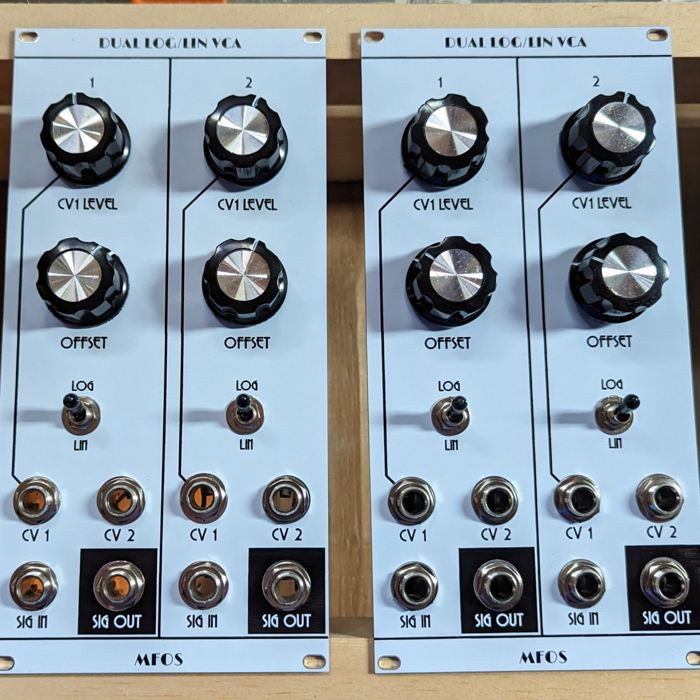

# MFOS Dual VCA

Kosmo format version of the [Music From Outer Space Dual VCA](http://musicfromouterspace.com/analogsynth_new/DUALVCA/DLLVCA001.html) synth module.

Circuit is basically unchanged from the original except:

* Eurorack style power header added, with reversal protection diodes
* Normal connection from 1st VCA output to 2nd VCA input

## Current draw
15 mA +12 V, 15 mA -12 V

## Photos

## Documentation

* [Schematic](Docs/dualvca_schematic.pdf)
* PCB layout: [front PCB front](Docs/Layout/dualvca_FrontPCB/dualvca_FrontPCB_front.svg), [front PCB back](Docs/Layout/dualvca_FrontPCB/dualvca_FrontPCB_back.svg), [back PCB front](Docs/Layout/dualvca_BackPCB/dualvca_BackPCB_front.svg), [back PCB back](Docs/Layout/dualvca_BackPCB/dualvca_BackPCB_back.svg)
* [BOM](Docs/BOM/dualvca_bom.md)
<!-- * [Build notes](Docs/build.md) -->
<!-- * [How it works](Docs/howitworks.md) -->
<!--* [Blog post]() -->

## GitHub repository

* [https://github.com/holmesrichards/dvca](https://github.com/holmesrichards/dvca)
